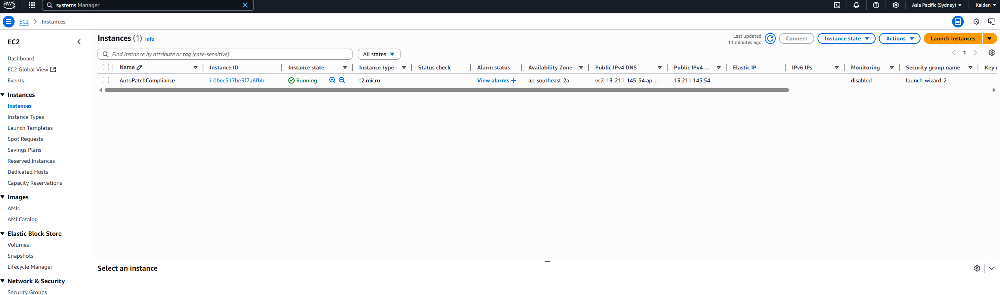
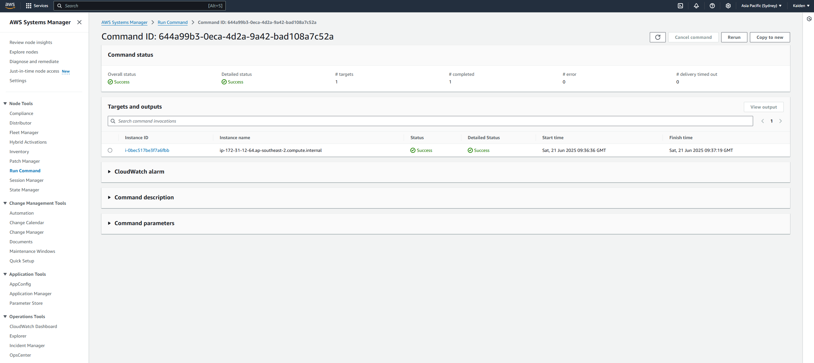
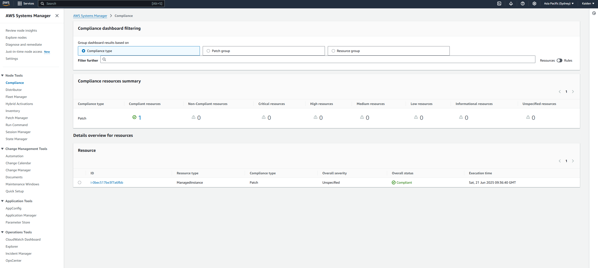

This project uses AWS Systems Manager (SSM) to remotely audit and apply security patches on an EC2 instance — without requiring SSH access. It demonstrates secure, automated patch compliance using native AWS tools and IAM roles.

## Features

1. Created an IAM role with AmazonSSMManagedInstanceCore permissions and attached it to an EC2 instance.
2. Verified the instance was connected to Systems Manager and appearing as a managed instance.
3. Used Run Command to scan for missing patches with the AWS-RunPatchBaseline document.
4. Reviewed the output logs and compliance status in the Systems Manager console.
5. Applied missing patches by running the same command with Operation=Install.

## AWS Services Used

- AWS Systems Manager (SSM)
- EC2 (Amazon Linux 2)
- IAM (SSM Role for EC2)
- AWS Run Command (AWS-RunPatchBaseline)

## Skills Demonstrated

- Remote instance management without SSH
- Patch auditing and compliance reporting
- IAM role configuration for EC2
- Use of SSM Run Command and log analysis

## Screenshots

### 1. EC2 Instance Dashboard

Shows the instance with t2.micro and the correct IAM role

---

### 2. Patch Scan Dashboard

Shows the patch scan ran successfully

---

### 3. Compliance Dashboard

Shows all instances are complaint

---

## Further Automation

After completing the project through the AWS Console, I recreated the process using the AWS CLI to automate the patch audit entirely through code. Future improvements included scheduled patching using SSM Automation documents such as AWS-ApplyPatchBaseline. Please see 'ssm_patch_scan.sh' for the full automation script.
